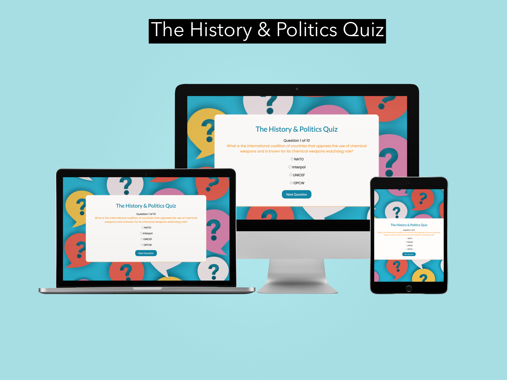
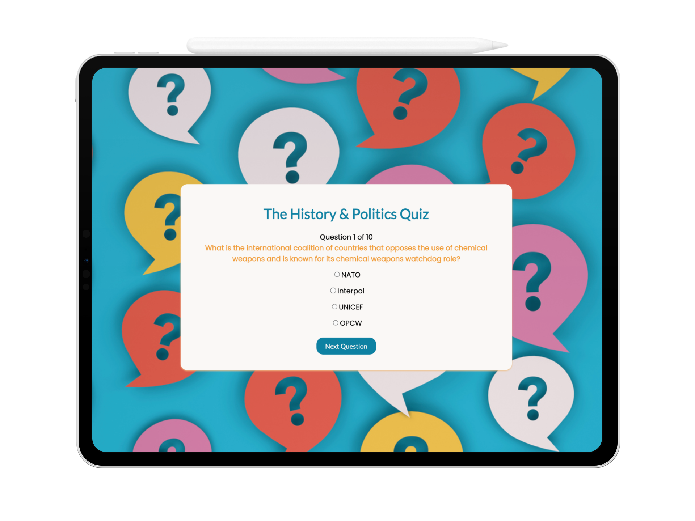
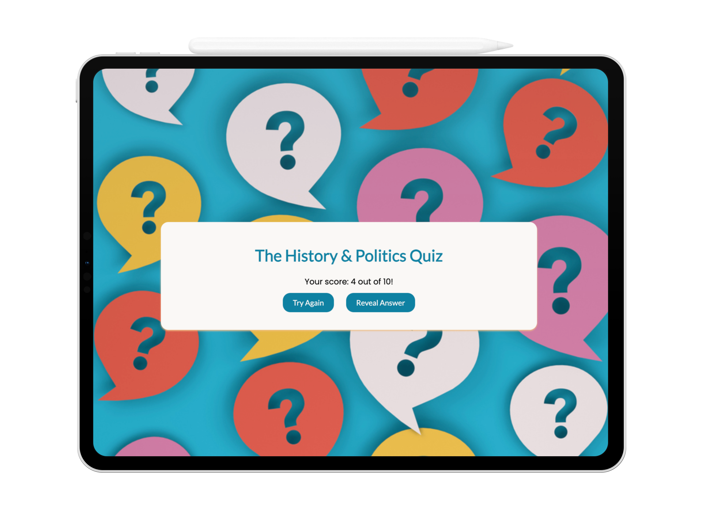
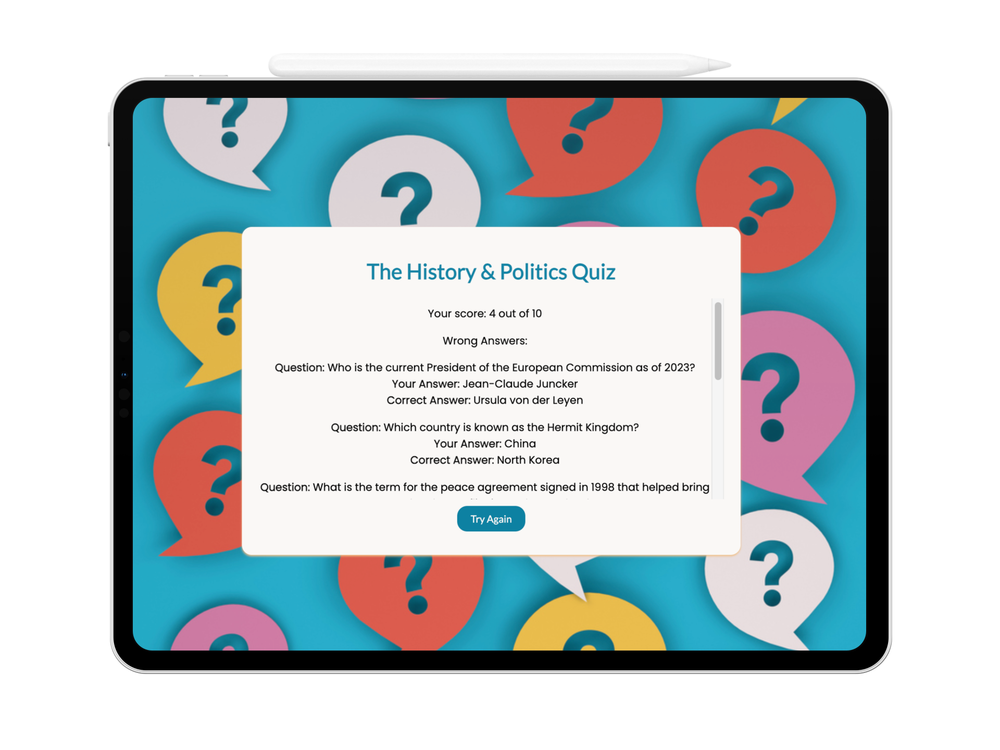
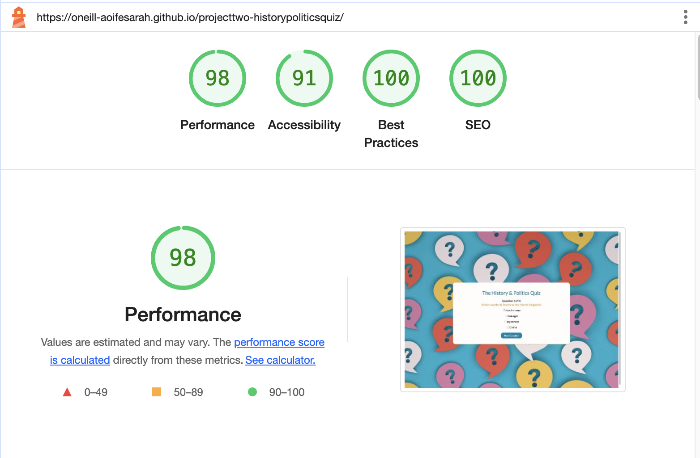

# The History & Politics Quiz

The History & Politics Quiz is a website for quiz enthusiasts. The quiz takes users on an exciting journey through the annals of history and the intricate world of politics. In this quiz, users can delve deep into the past and explore the complexities of the political landscape. From ancient civilizations to modern democracies, from influential leaders to groundbreaking movements, this quiz will test the users knowledge and challenge their understanding of the forces that have shaped the world.

This quiz presents ten multiple choice questions, allowing the user to choose from the selection of availble answers - only one of which is the correct answer. At the end of the quiz, the user has the opportunity to avail of feedback to see what answers they may have answered incorrectly and the 'Try Again' provides them with the option to retry the quiz, upon selection of which the questions are reshuffled so as to present the user with a new and exciting challenge.

Visit the deployed quiz website [here](https://oneill-aoifesarah.github.io/projecttwo-historypoliticsquiz/).

## Table of Contents

- [The History & Politics Quiz](#the-history-and-politics-quiz)
  - [Table of Contents](#table-of-contents)
  - [User Experience (UX)](#user-experience-ux)
    - [Project Goals](#project-goals)
    - [User Stories](#user-stories)
    - [Color Scheme](#color-scheme)
    - [Typography](#typography)
    - [Wireframes](#wireframes)
  - [Features](#features)
    - [General](#general)
    - [Website Walkthrough](#website-walkthrough)
  - [Technologies Used](#technologies-used)
    - [Languages Used](#languages-used)
    - [Frameworks, Libraries and Programs Used](#frameworks-libraries-and-programs-used)
  - [Testing](#testing)
    - [Testing User Stories](#testing-user-stories)
    - [Code Validation](#code-validation)
    - [Accessibility](#accessibility)
    - [Tools Testing](#tools-testing)
    - [Manual Testing](#manual-testing)
  - [Deployment](#deployment)
    - [GitHub Pages](#github-pages)
  - [Credits](#credits)
    - [Content](#content)
    - [Media](#media)
    - [Code](#code)
  - [Acknowledgements](#acknowledgements)

***

## User Experience (UX)

### Project Goals

* Engagement and Entertainment: Create a user-friendly quiz page that engages the user and provides them with an enjoyable experience.

* Educational Value: Offer a selection of questions on key historical and political events from across the globe to impart knowledge and encourage the users learning.

* Content Quality: Develop high-quality and accurate quiz questions and answers, with thorough research and fact-checking, to provide valuable content to users.

* Mobile Responsiveness: Optimize the quiz page for mobile devices to reach a broader audience and provide a consistent experience across different platforms, so as to encourage users to revisit the quiz in the future.

### User Stories

* User-Friendly Design: Users want an intuitive and easy-to-navigate design that allows them to start taking the quiz without confusion.

* Mobile Responsiveness: Many users access content on their mobile devices, so a responsive design that works well on smartphones and tablets is crucial.

* Engaging Content: Users look for interesting and well-crafted quiz questions that challenge their knowledge and keep them engaged.

* Feedback and Scoring: Immediate feedback on the users quiz performance, including scores and details of incorrect answers, is important for users to gauge their knowledge and progress.

* Fast Loading Times: Users expect the quiz page to load quickly to avoid frustration or abandonment.

* Visual Appeal: Users are more likely to engage with a quiz that has an attractive and visually appealing design.

### Color Scheme

The color palette utilised for site was chosen to ensure the content complemented the background image and to ensure the background image did not distract from the primary content of the webpages. The color palette, represented by white; blue; and orange shades evokes feelings of calm, happiness, and purity. To ensure the colors stood out from the background image, some adaption to the color palette were made to ensure text and content stood out and was presented in a clean, legible, and accesible manner.For the container background, a white color (#FFFDFB) was utilised; for the quiz title and buttons, a blue colour (#0881A3) was utilised; for the questions, and orange color was utilised (#f49c31); and for the button hover, a darker shade of blue (#276396) was utilised to ensure the hover fucntion was visible to the user. 

### Typography

The main font used in the site is Poppins, with Sans Serif as the backup font in the event the font is not functioning correctly. Lato is used for the headings, as suggested by Google Fonts for appropriate pairings with Poppins, with Sans Serif as the backup font.

### Wireframes

[Mockups](/assets/images/p2-mockupdesign.png) were utilised to draft the proposed approach to the development and design of the quiz. This was to ensure a visualisation of the project, the layout, and requirements to fulfill the project goals and objectives. The concept evolved during the course of development, however remained an essential tool to ensure the project remained within scope.

## Features

### General

* Responsive design to serve all device sizes.

* Similar color scheme, layout, and design throughout to effectively structure, categorise and present the information to the users in a clear and succint manner.

### Website Walkthrough

* **Question Page**

    - The first question is presented and highlights the number which that question falls within the total number of available questions. The background image, which presents a squence of question marks, aligns with the purpose of the quiz page. The subsequent questions follow the same structure and format, with the exception of the question counter that changes as the user progresses through the quiz so as to count the number of questions remaining. 

* **Results Section**

    - The results section, which is presented upon completion of the quiz, present the user with their total score; the opportunity to obtain further information on the answers submitted; and the opportunity to retry the quiz.

* **Reveal Answer Section**

  - The reveal answer section details the users total score; the questions which they answered incorrectly; the answer they provided to these questions; and the correct answers to the same. A scroll bar is available so that the user can scroll easily through their feedback should the wish to do so. At the end of the feedback, users are presented with an opportunity to retry the quiz.

* **Try Again**
  
  - Upon selection of the try again button, the questions are shuffled to ensure the quiz remains engaging throughout and that the users are not faced with repeating the same sequence of questions again.

[Back to top ⇧](#the-history-and-politics-quiz)

## Technologies Used

### Languages Used
* [HTML5](https://en.wikipedia.org/wiki/HTML5)
* [CSS3](https://en.wikipedia.org/wiki/CSS)
* [JavaScript](https://en.wikipedia.org/wiki/JavaScript)

### Frameworks, Libraries and Programs Used

* [Google Fonts](https://fonts.google.com/)
    - Google Fonts was used to import the fonts Lato, and Poppins into the style.css file. These fonts were used throughout the site.

* [Font Awesome](https://fontawesome.com/)
     - Font Awesome was used throughout all pages to add icons in order to create a better visual experience for UX purposes.

* [GitHub](https://github.com/)
     - GitHub was used to store the project after pushing.
  
* [CodeAnywhere](https://app.codeanywhere.com/)
    -  A cloud IDE platform was utilised for the code development and pushed to GitHub.

* [Chrome DevTools](https://developer.chrome.com/docs/devtools/)
    - Chrome DevTools was used during development process for code review and to test responsiveness.

* [W3C Markup Validator](https://validator.w3.org/)
    - W3C Markup Validator was used to validate the HTML code.

* [W3C CSS Validator](https://jigsaw.w3.org/css-validator/)
    - W3C CSS Validator was used to validate the CSS code.

- [JSHint JavaScript Validator](https://jshint.com/)
    - JSHint JavaScript Code Quality Tool was used to help detect error and potential code problems. 

## Testing

### Testing User Stories

* User-Friendly Design: Users want an intuitive and easy-to-navigate design that allows them to start taking the quiz without confusion.
    - As a user, the website offers an intuitive design and structure allowing the user to navigate the content easily.

* Mobile Responsiveness: Many users access content on their mobile devices, so a responsive design that works well on smartphones and tablets is crucial.
    - As a user, the website is accesible, functionable, and maintains the integrity of its design on all screen sizes and devices.

* Engaging Content: Users look for interesting and well-crafted quiz questions that challenge their knowledge and keep them engaged.
    - As a user, the variety of questions from across the globe and spanning both historical events and modern political issues supports the users engagement and interest.

* Feedback and Scoring: Immediate feedback on the users quiz performance, including scores and details of incorrect answers, is important for users to gauge their knowledge and progress.
   - As a user, the questions counter allows the user to ascertain how many questions remain to be completed and the reveal answer option upon completion for the quiz provides detailed feedback on the users progress in the quiz to support them in gaining further knowledge.

* Fast Loading Times: Users expect the quiz page to load quickly to avoid frustration or abandonment.
  - As a user, the mutiple choice option and buttons contained therein allows the user a 'one click' option to seamlessly navigate through the quiz.

* Visual Appeal: Users are more likely to engage with a quiz that has an attractive and visually appealing design.
  - As a user, the psychological response to the color scheme of white, blue, and orange evoke feelings of calm, happiness, energy, and peacefulness. The visual layout of the quiz ensures the content remains attractive and engaging to the user to support in their completion of the quiz.

### Code Validation

- The [W3C Markup Validator](https://validator.w3.org/), [W3C CSS Validator](https://jigsaw.w3.org/css-validator/), and [JSHint JavaScript Validator](https://jshint.com/) services were used to validate all pages of the project in order to ensure there were no syntax errors.

    - The W3C Markup Validator found a typo error in the favicon link. The typo was removed from the tag to correct this.
    [W3C Markup Validator Errors](assets/images/html-errors.2.png)
    [W3C Markup Validator Pass](assets/images/html-passed.2.png)

    -  The W3C CSS Validator found an error with the color code assigned to the container, noting a duplication which was not necessary. The typo was removed from the tag to correct this.
    [W3C CSS Valisator Errors](assets/images/cssvalidator-errors.2.png)
    [W3C CSS Validator Pass](assets/images/cssvalidator-passed.2.png)

    - The JSHint JavaScript Validator found an error with the displayResult variable which had not been called. Upon review, the displayResult was incorrectly labellef and should have stated showResult. The code was ammended to correct this.
    [JShint Javascript Validator Pass](assets/images/jshint-passed.2.png)

### Accessibility

* Lighthouse in Chrome DevTools was used to verify the performance, accesibility and utilisation of best practice throughout

* Lighthouse report

  

### Tools Testing

* [Chrome DevTools](https://developer.chrome.com/docs/devtools/)

    - Chrome DevTools was utilised consistently during the development process to test, explore and modify HTML elements and CSS styles used in the project.

* Responsiveness

    - Chrome DevTools was used to test responsiveness in different screen sizes during the development process.

### Manual Testing

* Browser Compatibility

    - The website has been tested on the following browsers:

        - **Google Chrome**
        
        No appearance, responsiveness nor functionality issues.

        - **Safari**
        
        No appearance, responsiveness nor functionality issues.

        - **Microsoft Edge**
        
        No appearance, responsiveness nor functionality issues.

* Device compatibility

    - The website has been tested on multiple devices, including:

        - **MacBook Air"**

        No appearance, responsiveness nor functionality issues.

        - **iPad Pro"**

        No appearance, responsiveness nor functionality issues.

        - **iPad Air"**

        No appearance, responsiveness nor functionality issues.

        - **iPhone 13**
        
        No appearance, responsiveness nor functionality issues.

        - **Samsung Galaxy S8**

        No appearance, responsiveness nor functionality issues.

 Common Elements Testing - All Pages
- **Questions & Answer Choices**
- Clicking on the answer will indicate the users selected answer

- **Next Question**

- Hovering on the button will trigger hover effect, highlighting the button in a darker shade of blue

- Clicking on the button will bring the user to the next question
        
- **Question Counter**
        
- The question counter highlights what number question the user is currently on and display the total count of questions contained within the quiz to support in the user progression and awareness of the remaining questions.
        
- **Results**
- The results section indicates the number of correct answers out of the total number of questions. Buttons are availble to select additional feedback in the form of reveal answers and also the option to retry the quiz
        
- **Show Answers** 
- The show answer button reveal the total number of correct answers out of the total number of questions. It also details the incorrect answers, with the breakdown of question; answer given by the user; and the correct answer
            
- The Try Again button is located at the bottom of the incorrect answers content allowing the user to select it, whereby they will automatically be redirected to start the quiz again.
        
- **Try Again**
- The selection of the Try Again button brings the user back to the start to retry the quiz.
           
- Questions are automatically reshuffled so that the user is met with a different sequence of questions.    

## Deployment

- This website was developed using [CodeAnywhere](https://app.codeanywhere.com/), which was then committed and pushed to GitHub using the CodeAnywhere terminal.

### GitHub Pages

* Here are the steps to deploy this website to GitHub Pages from its GitHub repository:

    1. Log in to GitHub and locate the [GitHub Repository](https://github.com/).

    2. At the top of the Repository, locate the Settings button on the menu.

    3. Scroll down the Settings page until you locate the Pages section.

    4. Under Source, click the dropdown and select 'Deploy from Branch'.

    5. Under Branch, click the dropdown called 'None' and select 'Main'.

    6. Refresh the page.
    
    7. Select 'Code', located at the top of the navbar.
    
    8. Select 'Deployments'
    
    9. Click to generated link to open your website. 

## Credits 

[CodewithFaraz](https://www.codewithfaraz.com)
[GeeksforGeeks](https://www.geeksforgeeks.org/)

### Content

- All content was written by the developer.

### Media

* [iSTOCK](https://www.istockphoto.com/)

    - Background image: "Question Mark on Speech Bubble".

### Code

* [Stack Overflow](https://stackoverflow.com/) and [W3Schools](https://www.w3schools.com/) were consulted on a regular basis to better understand the code being implemented.

[Back to top ⇧](#the-history-and-politics-quiz)

## Acknowledgements

* My tutor, Marcel, for his support and guidance.

* Code Institute and the Slack community for their ongoing support. 

[Back to top ⇧](#the-history-and-politics-quiz)
